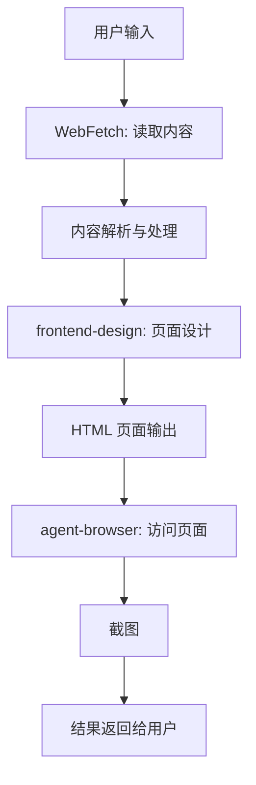

# Summary Poster Skill Design

将文章内容或网页内容转换为设计精美的页面，并提供截图功能。

## Overview

这是一个**纯文档型**技能，通过调用 Claude Code 现有的强大工具链实现：
- **WebFetch**：读取并解析用户提供的内容（URL、文本或文档）
- **frontend-design**：根据内容设计美观的展示页面（HTML+CSS）
- **agent-browser**：访问并截取设计好的页面

## Scope

### 功能范围

**包含的功能：**
- 接受用户提供的内容（URL、文本、文档）
- 使用 WebFetch 工具读取和解析内容
- 根据用户需求（如指定内容部分）设计页面
- 使用 frontend-design 设计 HTML 页面
- 使用 agent-browser 访问页面并截图
- 将截图结果返回给用户

**不包含的功能：**
- 不提供内容存储服务
- 不提供页面托管服务
- 不处理视频或音频内容

## Architecture

### 系统架构



### 工具链说明

| 工具 | 用途 | 说明 |
| --- | --- | --- |
| **WebFetch** | 内容读取 | 读取 URL、文档内容，支持选择特定部分 |
| **frontend-design** | 页面设计 | 根据内容设计美观的 HTML+CSS 页面 |
| **agent-browser** | 页面访问与截图 | 访问设计好的页面并截取全屏截图 |

## Design

### Skill Definition

```markdown
---
name: summary-poster
description: 将文章内容或网页内容转换为设计精美的页面，并提供截图功能。当用户提供内容（URL、文本、文档）和要求时，使用此技能读取内容、设计页面并截图返回。
---

# Summary Poster Skill

## 概述

将文章内容或网页内容转换为设计精美的页面，并提供截图功能。完全使用 Claude Code 的现有工具链实现。

## 使用场景

当用户想要：
- 将文章内容生成页面截图时
- 为文档创建视觉化摘要时
- 将网页内容转为可分享的图片时
- 为特定内容设计海报式页面时

## 完整工作流程

### 步骤 1：读取内容（WebFetch）

使用 WebFetch 工具读取内容：

```bash
# 读取完整 URL 内容
WebFetch --url "<URL>" --description "提取文章的主要内容"
```

```bash
# 读取指定部分内容（含用户说明）
WebFetch --url "<URL>" --description "提取文档中第 3-5 部分，关于技术架构的内容"
```

### 步骤 2：设计页面（frontend-design）

根据解析的内容，使用 frontend-design 设计 HTML 页面：

```bash
frontend-design --input "<解析后的内容>" --style "modern" --layout "article" --title "<页面标题>"
```

**设计选项：**
- `--style`: 页面风格（`modern`, `minimal`, `corporate`, `vintage`）
- `--layout`: 布局类型（`article`, `poster`, `sidebar`, `grid`）
- `--title`: 页面标题（默认从内容中自动提取）

### 步骤 3：访问页面并截图（agent-browser）

使用 agent-browser 访问设计好的页面并截图：

```bash
agent-browser --url "<页面URL>" --screenshot "full" --output "summary-poster.png"
```

### 完整命令链示例

```bash
# 将内容解析、页面设计和截图合并为一个工作流
WebFetch --url "<URL>" --description "<用户说明>" \
| xargs -I {} frontend-design --input {} --style "modern" --layout "article" \
| xargs -I {} agent-browser --url {} --screenshot "full" --output "summary-poster.png"
```

## 输入格式示例

### 示例 1：完整 URL + 内容部分说明

**用户输入：**
```
https://example.com/ai-trends-2026
请提取文章中关于生成式AI应用的部分，设计一个现代风格的页面，并截图返回。
```

**执行的命令链：**
```bash
WebFetch --url "https://example.com/ai-trends-2026" --description "提取文章中关于生成式AI应用的部分" \
| xargs -I {} frontend-design --input {} --style "modern" --layout "article" --title "2026生成式AI应用趋势" \
| xargs -I {} agent-browser --url {} --screenshot "full" --output "ai-trends-summary.png"
```

### 示例 2：本地内容 + 自定义标题

**用户输入：**
```
本地文档路径：~/Documents/research-paper.txt
请将文档的前两章内容设计成一个学术风格的页面，标题为"人工智能研究综述"。
```

**执行的命令链：**
```bash
WebFetch --url "file:///Users/user/Documents/research-paper.txt" --description "提取文档的前两章内容" \
| xargs -I {} frontend-design --input {} --style "academic" --layout "article" --title "人工智能研究综述" \
| xargs -I {} agent-browser --url {} --screenshot "full" --output "research-summary.png"
```

## 输出

### 截图规范

- **尺寸：** 全屏幕截图（1920×1080 或更大）
- **格式：** PNG（高质量）
- **文件名：** 自动生成，包含内容主题和时间戳

### 页面设计风格

支持以下页面风格：

| 风格 | 特点 | 适用场景 |
| --- | --- | --- |
| **modern** | 现代简洁风格，大留白 | 技术文章、新闻 |
| **minimal** | 极简风格，纯文字 | 学术文档、研究报告 |
| **corporate** | 商务风格，结构化 | 企业报告、白皮书 |
| **vintage** | 复古风格，纹理装饰 | 历史文档、传统内容 |

### 布局类型

支持以下布局类型：

| 布局 | 特点 | 适用场景 |
| --- | --- | --- |
| **article** | 传统文章布局 | 长文本内容 |
| **poster** | 海报式布局，强调视觉 | 内容摘要、展示 |
| **sidebar** | 侧边栏布局，多列 | 技术文档、教程 |
| **grid** | 网格布局，模块化 | 产品展示、列表 |

## 使用方式

### 安装说明

作为文档型技能，无需额外安装，直接在 Claude Code 中引用即可。

### 使用方法

在支持自定义 Skills 的 Agent 或 IDE 中，引用 `SKILL.md` 文件即可。

### 故障排除

#### 常见问题

**问题 1：WebFetch 读取内容失败**
- 检查 URL 是否有效
- 确认内容是否可公开访问
- 尝试调整描述参数

**问题 2：frontend-design 设计失败**
- 检查内容格式是否完整
- 尝试使用不同的风格和布局
- 简化设计要求

**问题 3：agent-browser 截图失败**
- 检查页面是否可正常访问
- 尝试调整截图尺寸和格式

## 创建技能的步骤

本技能使用 `/skill-creator` 工具创建：

1. 在项目根目录下运行命令：
   ```bash
   npx skills init summary-poster
   ```

2. 或者使用 Skill 工具：
   ```bash
   /skill-creator create --name summary-poster --template docs
   ```

3. 更新 `SKILL.md` 文件，复制上述内容

## Contribution

如需对本技能进行改进，请：
1. 更新 `SKILL.md` 文件
2. 更新设计文档
3. 测试修改后的工作流程

## License

本技能属于项目的一部分，遵循项目的开源许可证。
```
